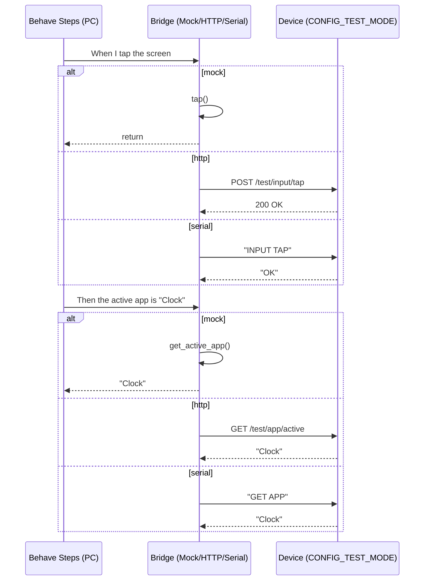

# Testing & QA

We use a layered approach:

1. Unit tests: domain logic and adapters (Unity/CMock)
2. Contract tests: ports like MQTT, persistence (fakes in test mode)
3. BDD: user-visible behavior across managers and apps (Gherkin)

The BDD .feature files live in `tests/bdd/features`. A small generator copies them into `docs/bdd` so they appear here as living documentation.

Future work:
- CONFIG_TEST_MODE bridge for step definitions
- Presenter/ViewModel pattern for each app to make UI state queryable

## Test bridge: who POSTs and who GETs (picture)

Your PC test runner (Behave) drives all actions. The device only responds.

Mermaid sequence (renders on GitHub; ASCII fallback below):



ASCII fallback:

```
Behave (.feature)  ->  Bridge (mock/http/serial)  ->  Device (CONFIG_TEST_MODE)
			When tap           mock: tap()                   in-process
												 http: POST /test/input/tap    200 OK
												 serial: INPUT TAP             OK

			Then app is        mock: get_active_app()        "Clock"
												 http: GET /test/app/active    "Clock"
												 serial: GET APP               "Clock"
```

Conceptual wiring:

```mermaid
graph TD
	B[Behave .feature steps] --> BR[Bridge]
	BR -->|mock| BR
	BR -->|http| D[Device (HTTP endpoints)]
	BR -->|serial| DU[Device (UART line protocol)]
	D --> E1[/test/input\n/test/state\n/test/config]
	DU --> E2["INPUT TAP"\n"GET STATE"]
```

Key points:
- The PC initiates all requests. The device never pushes to the PC.
- POST means “do something” (tap, rotate, set state/config). GET means “tell me your current state.”
- This pattern keeps tests deterministic and easy to port between mock, HTTP, and serial.
